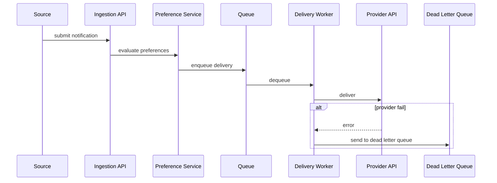

# Notification System — Core Flow

**Supports decision:** show the key retry and DLQ path for channel delivery.

```mermaid
sequenceDiagram
  participant S as Source
  participant API as Ingestion API
  participant P as Preference Service
  participant Q as Queue
  participant W as Delivery Worker
  participant D as Provider API
  participant DLQ as Dead Letter Queue

  S->>API: submit notification
  API->>P: evaluate preferences
  P->>Q: enqueue delivery
  Q->>W: dequeue
  W->>D: deliver
  alt provider fail
    D-->>W: error
    W->>DLQ: send to dead letter queue
  end
```