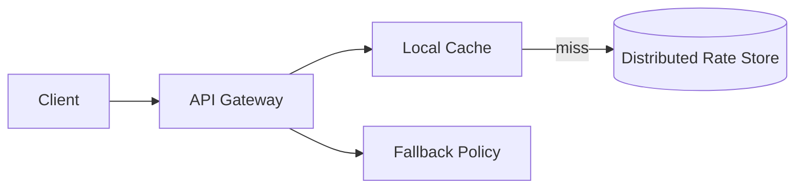

# Rate Limiter

A rate limiter must enforce request quotas consistently across a distributed fleet while preserving low latency for authorization decisions. The design should support bursty traffic, hot keys, and safe fallback when the shared state store is degraded.

## Problem framing

- **Users:** API clients, internal services, end users
- **Peak load:** ~200k rate checks per second, with bursts up to 5x
- **Critical path:** decide allow/deny in <5ms for API latency budgets
- **Business goals:** protect backend resources, avoid unfair denial, support usage tiers

## Requirements

- Enforce per-user and global quotas
- Support fixed window, sliding window, and token bucket policies
- Share state across instances in a multi-region deployment
- Handle bursts gracefully and avoid thundering herd failures
- Provide metrics for quota consumption and violations

## Key constraints

- Centralized state lookups add latency; caches can stale counters
- Strict global limits require distributed consensus or approximate algorithms
- Hot users may dominate shared counters and cause contention
- Degraded availability should not result in complete service outage
- Correctness depends on consistent clock assumptions and retry handling

## Architecture overview

- **API gateway / sidecar** intercepts requests and performs rate checks.
- **Rate store** maintains distributed counters in Redis or a specialized in-memory store.
- **Local cache** stores recent quota state for low-latency decisions.
- **Reconciliation process** syncs local and global counters to avoid overuse.
- **Fallback mode** uses a safe degraded limit or token bucket approximation.

## API sketch

| Method | Path | Notes |
|--------|------|-------|
| GET | /quota/{userId} | Query current quota status |
| POST | /check | Evaluate request against limits |
| POST | /rules | Update quota policy |

## Data model

- `QuotaPolicy`
  - `policyId`
  - `scope` (user, tenant, global)
  - `limit`
  - `windowSeconds`
  - `burstCapacity`
  - `penalty`

- `QuotaCounter`
  - `key`
  - `currentTokens`
  - `lastUpdated`
  - `windowStart`

## Diagrams

- [Context](./diagrams/context.md)
- [Components](./diagrams/components.md)
- [Core flow](./diagrams/core-flow.md)

## Code examples

- [Java](./java/TokenBucketLimiter.java)
- [Go](./go/token_bucket.go)

## Code sketch: token bucket in Go

```go
func allowRequest(key string) bool {
  now := time.Now().Unix()
  counter := store.Get(key)
  elapsed := now - counter.lastUpdated
  tokens := min(counter.limit, counter.tokens+int(elapsed*rate))
  if tokens <= 0 {
    return false
  }
  counter.tokens = tokens - 1
  counter.lastUpdated = now
  store.Save(key, counter)
  return true
}
```

## Reliability and failure modes

- **Shared store outage:** degrade to local limits or probabilistic allowlist
- **Hot key contention:** shard counters by hash and use per-key tokens
- **Clock drift:** avoid absolute timestamps or use monotonic durations
- **Retry storms:** combine quota checks with exponential backoff and burst smoothing
- **Inconsistent state:** reconcile counters with periodic snapshots and compare expected consumption

## Diagram



## If I had two more weeks

- Add a “dry-run” mode for policy tuning and quota simulation
- Implement active feedback to clients with expected reset times
- Add support for hierarchical quotas across organizations and tenants

## Three scale triggers

1. **Burst storms on a small set of users** → add hot-key sharding and local token caches
2. **Cross-region volume** → move quota state to region-local stores with periodic sync
3. **Quota rules churn** → separate policy store and validate changes before rollout

## Interview prompts

- How would you enforce a distributed rate limit with low latency?
- What is the difference between token bucket and fixed-window rate limiting?
- How can you keep availability when the central quota store is unavailable?
