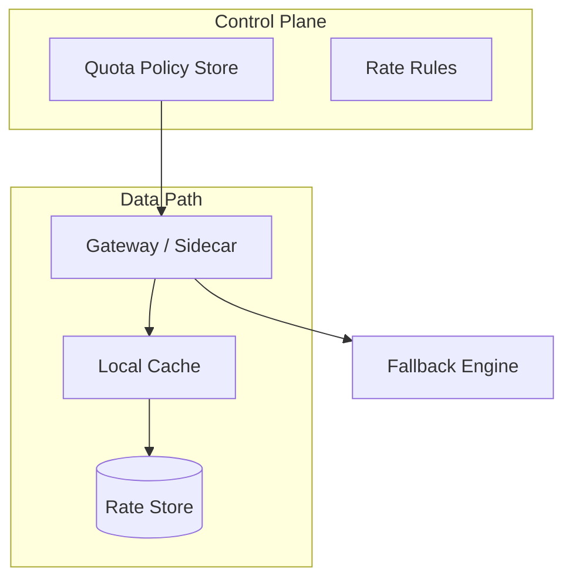

# Rate Limiter — Components

**Supports decision:** identify the core components of a distributed rate limiting architecture.

```mermaid
flowchart TB
  subgraph control [Control Plane]
    policy[Quota Policy Store]
    config[Rate Rules]
  end
  subgraph data [Data Path]
    gateway[Gateway / Sidecar]
    cache[Local Cache]
    store[(Rate Store)]
  end
  fallback[Fallback Engine]

  gateway --> cache --> store
  gateway --> fallback
  policy --> gateway
```