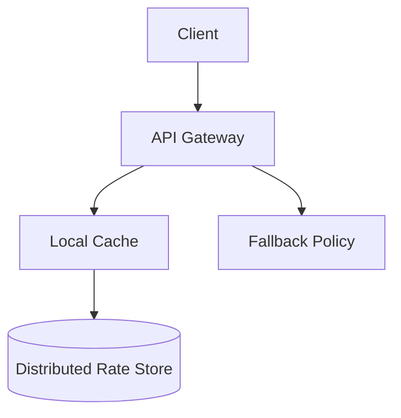

# Rate Limiter — Context

**Supports decision:** show how rate checks integrate with clients, cache, and global store.

```mermaid
flowchart TB
  client[Client]
  gateway[API Gateway]
  cache[Local Cache]
  store[(Distributed Rate Store)]
  fallback[Fallback Policy]

  client --> gateway
  gateway --> cache
  cache --> store
  gateway --> fallback
```