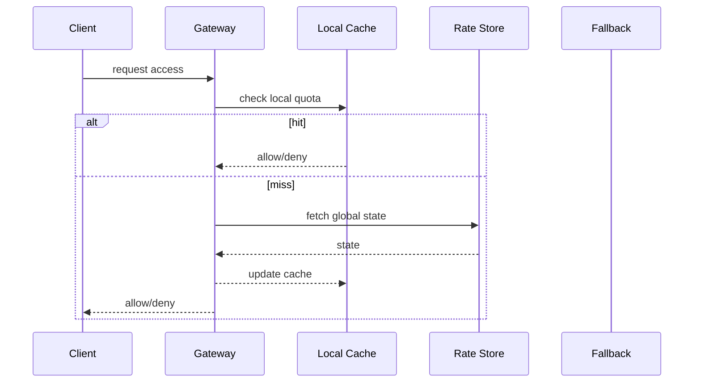

# Rate Limiter — Core Flow

**Supports decision:** describe the critical path of an allow/deny decision.

```mermaid
sequenceDiagram
  participant C as Client
  participant G as Gateway
  participant L as Local Cache
  participant S as Rate Store
  participant F as Fallback

  C->>G: request access
  G->>L: check local quota
  alt hit
    L-->>G: allow/deny
  else miss
    G->>S: fetch global state
    S-->>G: state
    G-->>L: update cache
    G-->>C: allow/deny
  end
```