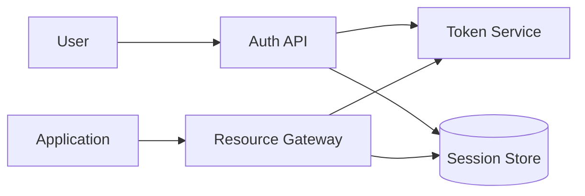

# Authentication System

An authentication system must authenticate users, issue secure session tokens, and manage refresh and revocation. It should defend against token replay, account takeover, and session abuse while keeping login latency acceptable.

## Problem framing

- **Users:** web/mobile users, service accounts, API clients
- **Peak load:** ~20k logins per minute, 100k token validations per second
- **Critical path:** authenticate token or session in <20ms
- **Business goals:** secure access, smooth refresh, revocable sessions, and multi-factor support

## Requirements

- Authenticate credentials and issue access tokens and refresh tokens
- Support session revocation and token blacklisting
- Allow OAuth/OIDC and traditional username/password flows
- Validate tokens efficiently at service boundaries
- Track and throttle login attempts and MFA challenges

## Key constraints

- Token validation must be fast and stateless when possible
- Refresh flow must avoid reuse and replay attacks
- Revocation lists can grow large and must be queryable efficiently
- Multi-factor authentication adds latency and state complexity
- Third-party identity providers introduce external dependency risk

## Architecture overview

- **Auth API** handles login, token refresh, and logout.
- **Token service** issues signed JWTs or opaque tokens.
- **Session store** tracks refresh tokens, revocation, and MFA state.
- **Policy service** enforces MFA, rate limiting, and device trust.
- **Resource gateway** validates access tokens at each request.

## API sketch

| Method | Path | Notes |
|--------|------|-------|
| POST | /login | Authenticate and issue tokens |
| POST | /refresh | Use refresh token to mint new access token |
| POST | /logout | Revoke active refresh token |
| POST | /validate | Validate token at gateway |

## Data model

- `Session`
  - `sessionId`
  - `userId`
  - `refreshToken`
  - `expiresAt`
  - `revoked`
  - `deviceInfo`
  - `createdAt`

- `TokenPolicy`
  - `tokenType`
  - `expirySeconds`
  - `refreshWindowSeconds`
  - `mfaRequired`

- `RevocationEntry`
  - `tokenId`
  - `revokedAt`
  - `reason`

## Diagrams

- [Context](./diagrams/context.md)
- [Components](./diagrams/components.md)
- [Core flow](./diagrams/core-flow.md)

## Code examples

- [Java](./java/RefreshTokenHandler.java)
- [Go](./go/refresh_token_handler.go)

## Code sketch: refresh token validation

```go
func refreshToken(req RefreshRequest) (*AuthResponse, error) {
  session, err := sessionStore.Get(req.RefreshToken)
  if err != nil || session.Revoked {
    return nil, ErrUnauthorized
  }
  if time.Now().After(session.ExpiresAt) {
    return nil, ErrRefreshExpired
  }
  newAccess := tokenService.IssueAccessToken(session.UserID)
  return &AuthResponse{AccessToken: newAccess}, nil
}
```

```java
public AuthResponse refresh(RefreshRequest request) {
  Session session = sessionRepository.findByRefreshToken(request.getRefreshToken());
  if (session == null || session.isRevoked()) {
    throw new UnauthorizedException();
  }
  if (session.getExpiresAt().isBefore(Instant.now())) {
    throw new RefreshTokenExpiredException();
  }
  String accessToken = tokenService.issueAccessToken(session.getUserId());
  return new AuthResponse(accessToken);
}
```

## Reliability and failure modes

- **Token replay:** use one-time refresh tokens and rotate on each refresh
- **Revocation lag:** keep short-lived access tokens and a fast revocation cache
- **Clock skew:** validate with acceptable drift and use monotonic refresh windows
- **Provider outage:** degrade to cached token validation and deny new login issuance if session store is unavailable
- **MFA failure:** keep MFA state durable and allow recovery paths without weakening security

## Diagram



## If I had two more weeks

- Add device management and token audit trails
- Add continuous risk scoring for login decisions
- Build a conditional access policy engine for adaptive auth

## Three scale triggers

1. **Login storms** → cache credential validation results safely and use queue-based login processing
2. **Token validation volume** → switch to stateless token validation with short expiry and fast key rotation
3. **Revocation traffic** → shard revocation cache and limit revocation lookups by using token age heuristics

## Interview prompts

- When should you use opaque refresh tokens instead of JWTs?
- How do you handle logout and token revocation at scale?
- What is a secure refresh token rotation strategy?
