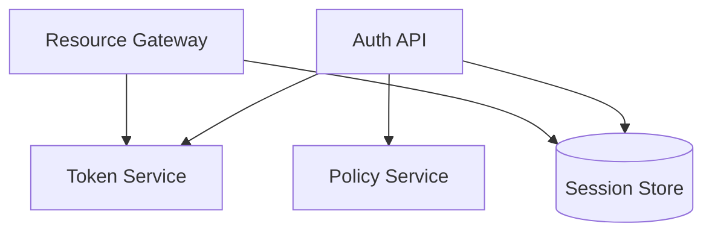

# Authentication System — Components

**Supports decision:** identify token service, session state, and validation components.

```mermaid
flowchart TB
  auth[Auth API]
  token[Token Service]
  session[(Session Store)]
  policy[Policy Service]
  gateway[Resource Gateway]

  auth --> token
  auth --> session
  auth --> policy
  gateway --> token
  gateway --> session
```