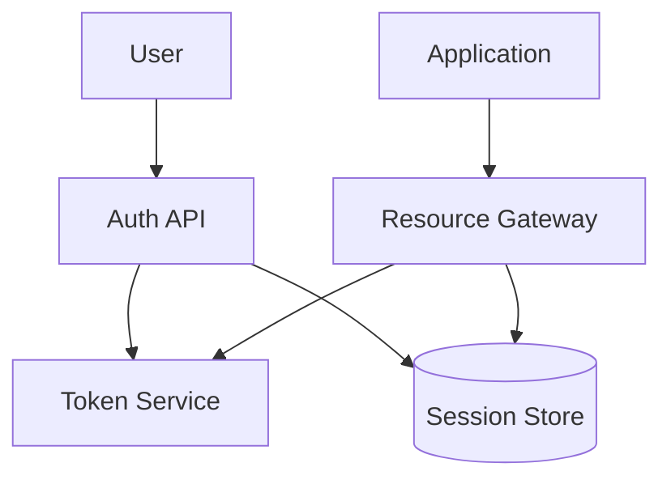

# Authentication System — Context

**Supports decision:** show authentication flow, token issuance, and validation boundaries.

```mermaid
flowchart TB
  user[User]
  auth[Auth API]
  token[Token Service]
  session[(Session Store)]
  gateway[Resource Gateway]
  app[Application]

  user --> auth
  auth --> token
  auth --> session
  app --> gateway --> token
  gateway --> session
```