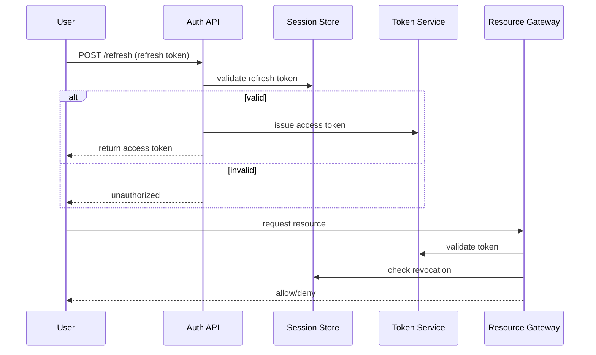

# Authentication System — Core Flow

**Supports decision:** show the refresh and validation flow for tokens.

```mermaid
sequenceDiagram
  participant U as User
  participant A as Auth API
  participant S as Session Store
  participant T as Token Service
  participant G as Resource Gateway

  U->>A: POST /refresh (refresh token)
  A->>S: validate refresh token
  alt valid
    A->>T: issue access token
    A-->>U: return access token
  else invalid
    A-->>U: unauthorized
  end
  U->>G: request resource
  G->>T: validate token
  G->>S: check revocation
  G-->>U: allow/deny
```