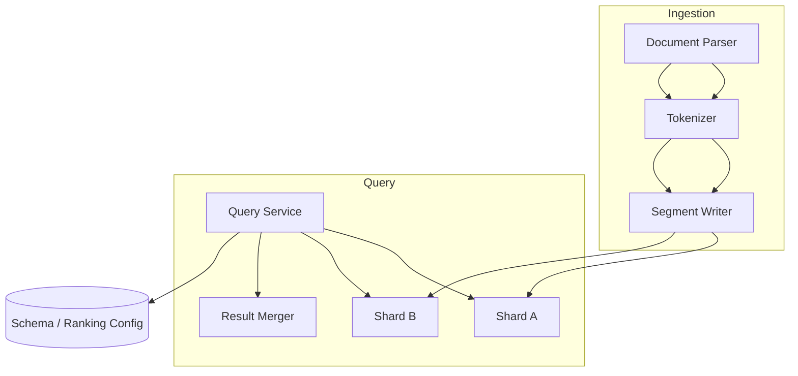

# Search Engine — Components

**Supports decision:** identify index builder, query service, and replica components.

```mermaid
flowchart TB
  subgraph ingest [Ingestion]
    parser[Document Parser]
    tokenizer[Tokenizer]
    segment[Segment Writer]
  end
  subgraph query [Query]
    querySvc[Query Service]
    merger[Result Merger]
    shardA[Shard A]
    shardB[Shard B]
  end
  config[(Schema / Ranking Config)]

  parser --> tokenizer --> segment --> shardA
  parser --> tokenizer --> segment --> shardB
  querySvc --> shardA
  querySvc --> shardB
  querySvc --> merger
  querySvc --> config
```