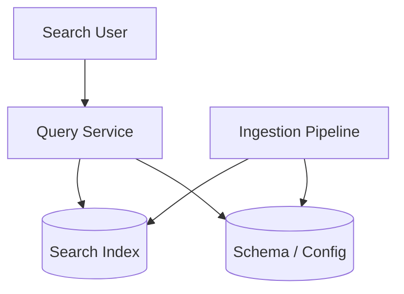

# Search Engine — Context

**Supports decision:** show the ingest and query boundaries for a search engine.

```mermaid
flowchart TB
  user[Search User]
  query[Query Service]
  index[(Search Index)]
  ingest[Ingestion Pipeline]
  metadata[(Schema / Config)]

  user --> query
  query --> index
  ingest --> index
  ingest --> metadata
  query --> metadata
```