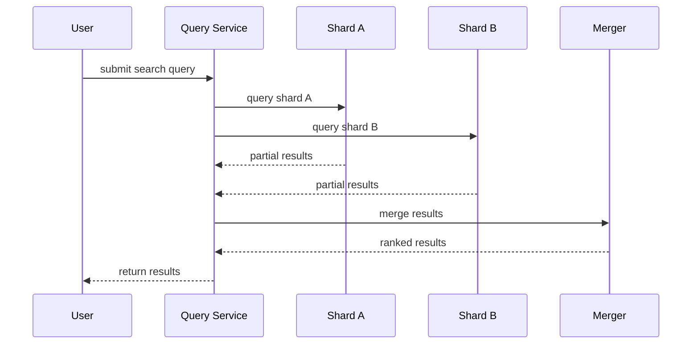

# Search Engine — Core Flow

**Supports decision:** document the path from query submission to merged results.

```mermaid
sequenceDiagram
  participant U as User
  participant Q as Query Service
  participant S1 as Shard A
  participant S2 as Shard B
  participant M as Merger

  U->>Q: submit search query
  Q->>S1: query shard A
  Q->>S2: query shard B
  S1-->>Q: partial results
  S2-->>Q: partial results
  Q->>M: merge results
  M-->>Q: ranked results
  Q-->>U: return results
```