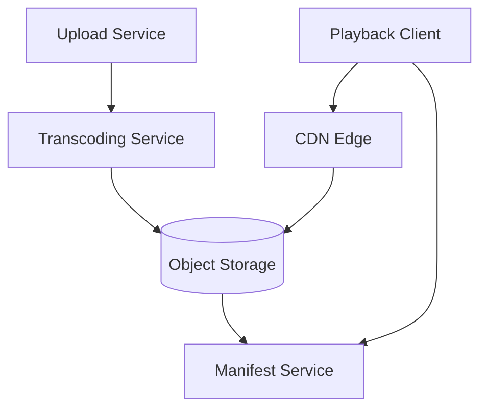

# Video Streaming — Components

**Supports decision:** identify upload, transcoding, storage, and CDN layers.

```mermaid
flowchart TB
  upload[Upload Service]
  encode[Transcoding Service]
  storage[(Object Storage)]
  manifest[Manifest Service]
  cdn[CDN Edge]
  player[Playback Client]

  upload --> encode --> storage
  storage --> manifest
  player --> cdn
  cdn --> storage
  player --> manifest
```