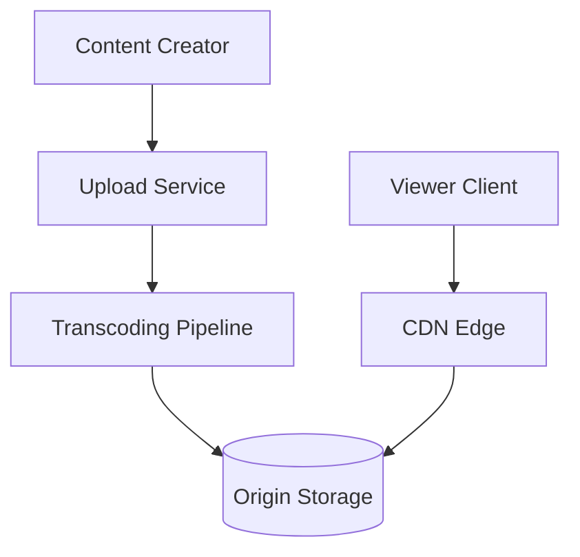

# Video Streaming — Context

**Supports decision:** show upload, transcode, origin, and CDN boundaries.

```mermaid
flowchart TB
  creator[Content Creator]
  upload[Upload Service]
  transcode[Transcoding Pipeline]
  origin[(Origin Storage)]
  cdn[CDN Edge]
  viewer[Viewer Client]

  creator --> upload --> transcode --> origin
  viewer --> cdn --> origin
```