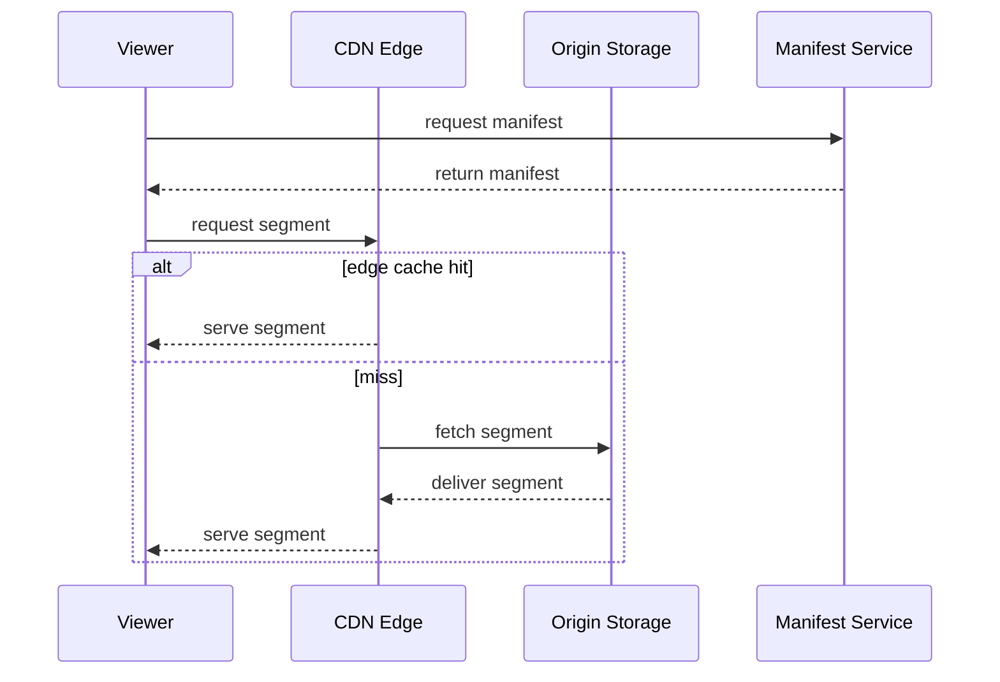

# Video Streaming — Core Flow

**Supports decision:** show the playback flow from client to CDN origin.

```mermaid
sequenceDiagram
  participant V as Viewer
  participant C as CDN Edge
  participant O as Origin Storage
  participant M as Manifest Service

  V->>M: request manifest
  M-->>V: return manifest
  V->>C: request segment
  alt edge cache hit
    C-->>V: serve segment
  else miss
    C->>O: fetch segment
    O-->>C: deliver segment
    C-->>V: serve segment
  end
```