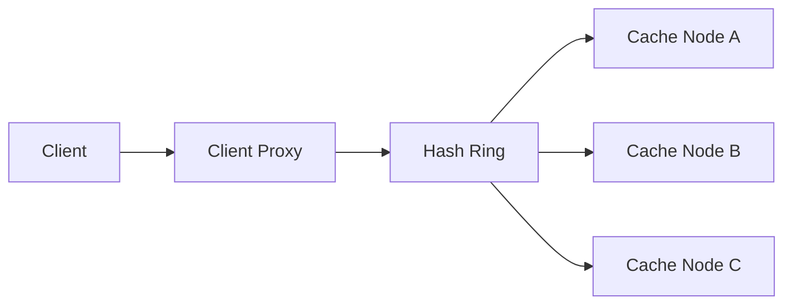

# Distributed Cache

A distributed cache must serve low-latency reads for hot data, stay consistent with backing storage, and manage membership changes safely. The design should handle eviction, cache invalidation, and hot-key pressure in a scalable cluster.

## Problem framing

- **Users:** backend services, API gateways, data caches
- **Peak load:** millions of cache operations per second
- **Critical path:** cache hit processing in <1ms
- **Business goals:** minimize database load, maintain freshness, scale with membership changes

## Requirements

- Store and retrieve key-value entries with TTL
- Support cluster membership and partitioning
- Evict entries based on LRU / LFU policies
- Handle cache invalidation and write-through/update patterns
- Manage duplicates and replication for availability

## Key constraints

- Strong consistency is expensive across nodes; eventual consistency may be acceptable
- Hot keys can saturate a single partition or node
- Membership changes require rebalancing and data movement
- Eviction policies need to consider memory and network trade-offs
- Cache should not become a single source of data correctness

## Architecture overview

- **Client library / proxy** routes reads and writes to cache nodes
- **Partitioning layer** maps keys to nodes using consistent hashing
- **Replication layer** keeps backups available for failover
- **Eviction manager** reclaims memory and notifies clients as needed
- **Invalidation service** propagates invalidations or updates for cache coherence

## API sketch

| Method | Path | Notes |
|--------|------|-------|
| GET | /cache/{key} | Retrieve value |
| PUT | /cache/{key} | Write value |
| DELETE | /cache/{key} | Invalidate key |
| POST | /cache/invalidate | Broadcast invalidation |

## Data model

- `CacheEntry`
  - `key`
  - `value`
  - `ttl`
  - `lastAccessed`
  - `version`

- `Partition`
  - `partitionId`
  - `nodeIds`
  - `replicaFactor`

- `MembershipEvent`
  - `nodeId`
  - `eventType`
  - `timestamp`

## Diagrams

- [Context](./diagrams/context.md)
- [Components](./diagrams/components.md)
- [Core flow](./diagrams/core-flow.md)

## Code examples

- [Java](./java/ConsistentHashRing.java)
- [Go](./go/consistent_hash_ring.go)

## Code sketch: consistent hashing ring

```go
func locateNode(key string) string {
  hash := hashFn(key)
  for _, point := range ring.sortedPoints {
    if point >= hash {
      return point.nodeID
    }
  }
  return ring.sortedPoints[0].nodeID
}
```

## Reliability and failure modes

- **Node failure:** route queries to replicas and rebuild missing partitions
- **Hot key skew:** split hot keys into smaller logical shards or use a local cache
- **Stale data:** use versioned entries and invalidation messages for stronger coherence
- **Rebalance storms:** batch membership changes and throttle data movement
- **Memory pressure:** evict cold data first and limit write amplification

## Diagram



## If I had two more weeks

- Add a tiered cache with both local and cluster-level layers
- Add a metrics dashboard that surfaces cache hit ratio by key heat
- Add a write-through invalidation protocol with transaction-aware coherence

## Three scale triggers

1. **Hot-key traffic** → add local caches and hot-key splitting or token bucket gating
2. **Membership churn** → reduce reshuffle cost with virtual nodes
3. **Write-heavy workloads** → convert cold data to write-around or read-through patterns

## Interview prompts

- Why is consistent hashing useful in a distributed cache?
- How would you handle a hot key that receives far more traffic than average?
- What are the trade-offs between write-through and write-around caching?
