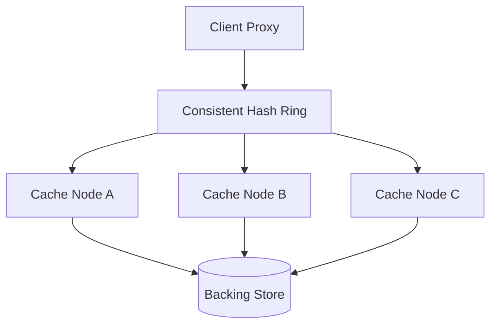

# Distributed Cache — Components

**Supports decision:** show partitioning and replica relationships in the cache cluster.

```mermaid
flowchart TB
  proxy[Client Proxy]
  ring[Consistent Hash Ring]
  nodeA[Cache Node A]
  nodeB[Cache Node B]
  nodeC[Cache Node C]
  storage[(Backing Store)]

  proxy --> ring
  ring --> nodeA
  ring --> nodeB
  ring --> nodeC
  nodeA --> storage
  nodeB --> storage
  nodeC --> storage
```