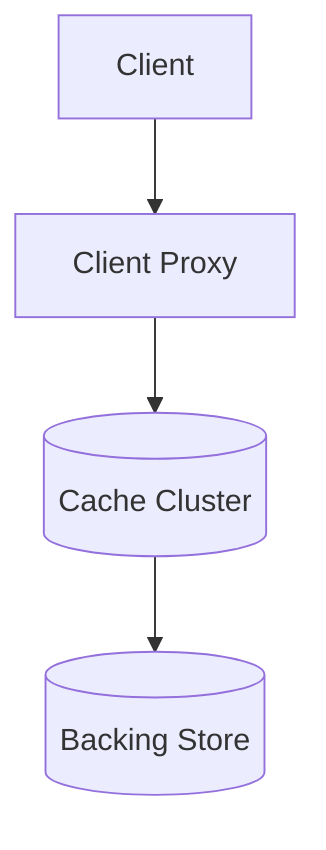

# Distributed Cache — Context

**Supports decision:** show clients, cache cluster, and backing store interactions.

```mermaid
flowchart TB
  client[Client]
  proxy[Client Proxy]
  cache[(Cache Cluster)]
  storage[(Backing Store)]

  client --> proxy --> cache
  cache --> storage
```