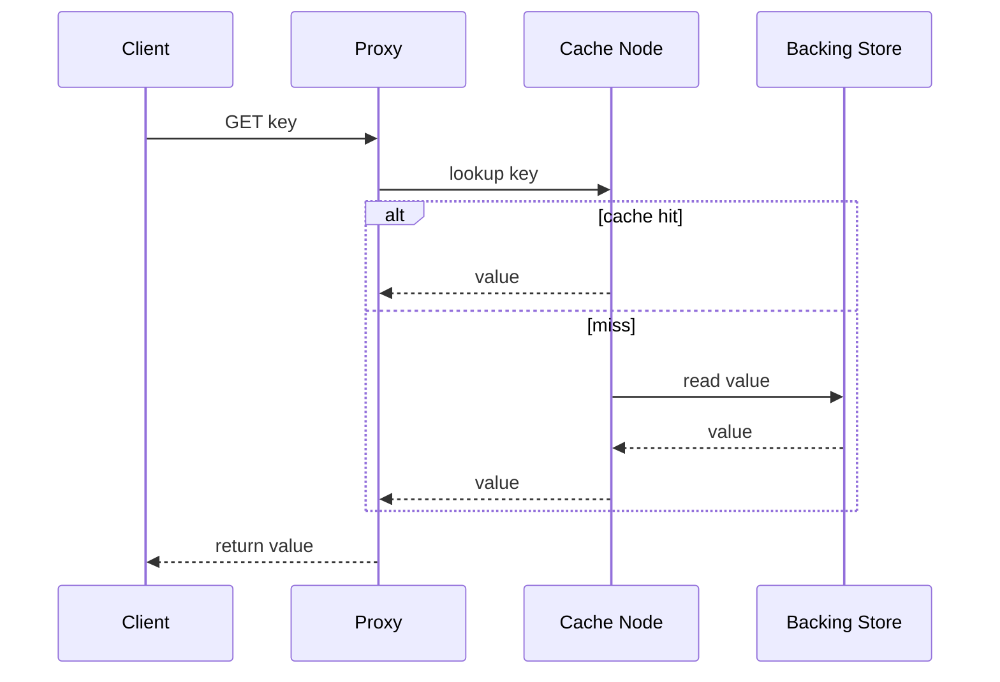

# Distributed Cache — Core Flow

**Supports decision:** show the key lookup path and fallback to backing storage.

```mermaid
sequenceDiagram
  participant C as Client
  participant P as Proxy
  participant N as Cache Node
  participant S as Backing Store

  C->>P: GET key
  P->>N: lookup key
  alt cache hit
    N-->>P: value
  else miss
    N->>S: read value
    S-->>N: value
    N-->>P: value
  end
  P-->>C: return value
```