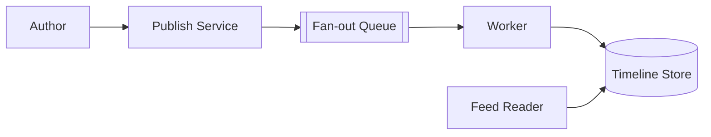

# Feed / Timeline

A feed system must deliver personalized content to users while balancing write cost, read latency, and freshness. The design should handle high fan-out, ranking signals, and the celebrity problem with many followers.

## Problem framing

- **Users:** social app users, content consumers, recommendation services
- **Peak load:** tens of millions of timeline reads per minute
- **Critical path:** return feed items in <300ms
- **Business goals:** high relevance, fresh content, bounded response size

## Requirements

- Deliver ordered feed items to users with personalization
- Support write-heavy content creation and read-heavy feeds
- Rank posts using relevance and recency signals
- Handle celebrity and viral content without overwhelming system
- Allow timeline refresh and pagination

## Key constraints

- Fan-out on write can create enormous downstream work
- Read path must be fast, but content may be stale if precomputed
- Ranking signals can change after an item is written
- Hot users and topics can create cascading load
- Storage cost rises with precomputed feed copies

## Architecture overview

- **Producer service** accepts new content and computes follower set.
- **Fan-out workers** push items to follower timelines or a shared stream.
- **Timeline store** holds per-user feed entries and read state.
- **Ranking service** reorders items at read time or maintains ranked precomputations.
- **Backfill and catch-up** fill gaps for users who were offline.

## API sketch

| Method | Path | Notes |
|--------|------|-------|
| POST | /posts | Publish content |
| GET | /feed | Retrieve personalized timeline |
| POST | /feed/refresh | Refresh feed if stale |
| POST | /like | Update ranking signals |

## Data model

- `Post`
  - `postId`
  - `authorId`
  - `createdAt`
  - `content`
  - `signals`

- `TimelineEntry`
  - `userId`
  - `postId`
  - `rankScore`
  - `insertedAt`

- `FollowGraph`
  - `userId`
  - `followerIds`

## Diagrams

- [Context](./diagrams/context.md)
- [Components](./diagrams/components.md)
- [Core flow](./diagrams/core-flow.md)

## Code examples

- [Java](./java/FeedFanOut.java)
- [Go](./go/feed_fanin.go)

## Code sketch: fan-out vs fan-in decision

```java
// Fan-out on write: push to each follower timeline
for (String follower : followers) {
  timelineStore.append(follower, entry);
}
```

```go
// Fan-in on read: query recent posts and merge
posts := feedStore.RecentFor(followedAccounts)
ranked := ranker.Score(posts)
return ranked
```

## Reliability and failure modes

- **Celebrity flood:** use batching and capped fan-out for very large follower sets
- **Stale timelines:** refresh on read and backfill missed notifications
- **Ranking drift:** separate base feed from dynamic signals to avoid stale ordering
- **Failure during fan-out:** durable queue with replay and idempotent writes
- **Storage explosion:** compress timeline entries and expire old content aggressively

## Diagram



## If I had two more weeks

- Add dynamic ranking using engagement and personalization signals
- Implement real-time push updates and cache invalidation for active users
- Add analytics for feed quality and freshness metrics

## Three scale triggers

1. **Celebrity posts** → switch to fan-in for supernodes or apply capping
2. **Read-heavy bursts** → add read replicas and query-level caching
3. **Signal-driven re-ranking** → compute diffs incrementally instead of full refreshes

## Interview prompts

- What are the trade-offs between fan-out-on-write and fan-in-on-read?
- How would you handle a user with millions of followers?
- How do you keep feed latency low while supporting personalized ranking?
