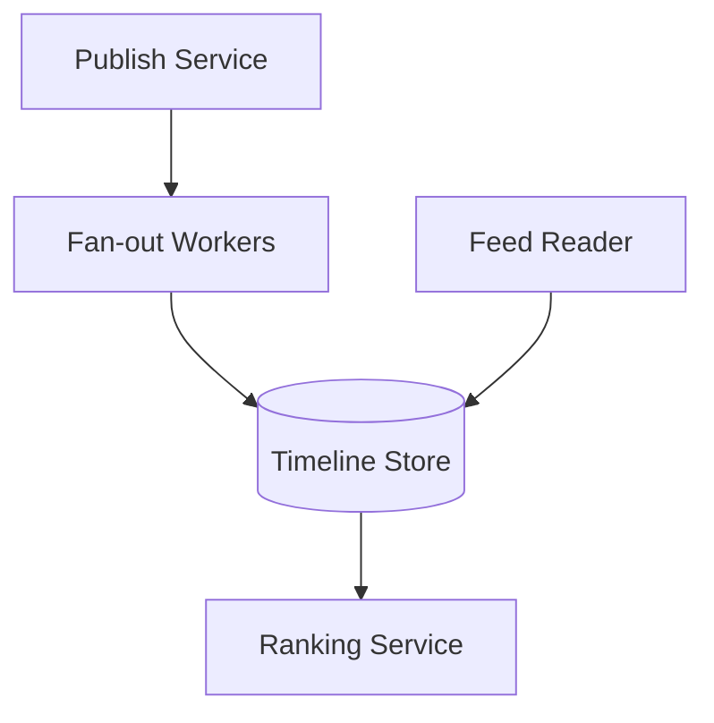

# Feed / Timeline — Components

**Supports decision:** identify publishing, storage, and ranking components.

```mermaid
flowchart TB
  publish[Publish Service]
  fanout[Fan-out Workers]
  timeline[(Timeline Store)]
  ranker[Ranking Service]
  reader[Feed Reader]

  publish --> fanout --> timeline
  reader --> timeline --> ranker
```