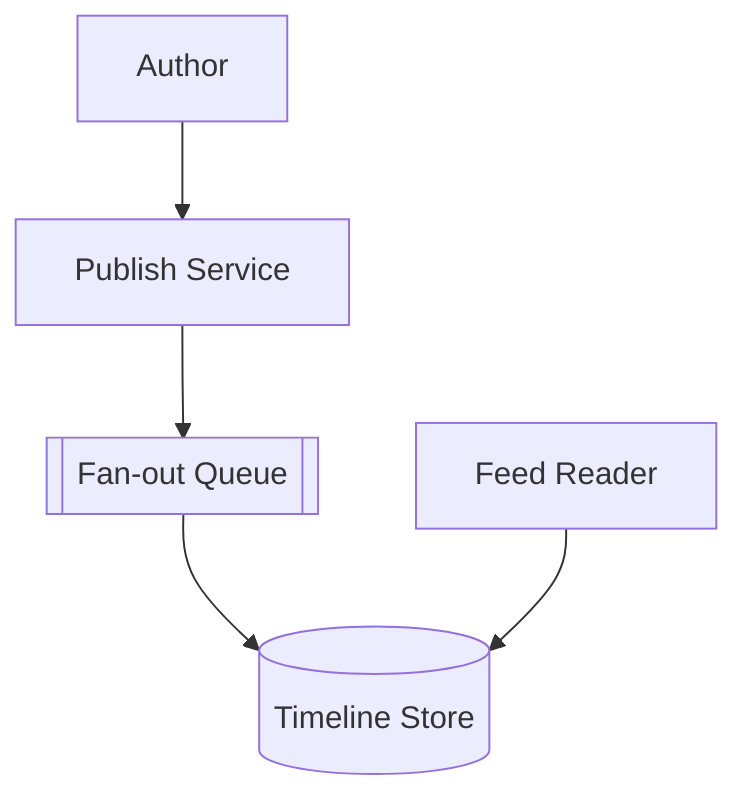

# Feed / Timeline — Context

**Supports decision:** show producers, timeline store, and reader flows.

```mermaid
flowchart TB
  author[Author]
  publish[Publish Service]
  queue[[Fan-out Queue]]
  timeline[(Timeline Store)]
  reader[Feed Reader]

  author --> publish --> queue --> timeline
  reader --> timeline
```