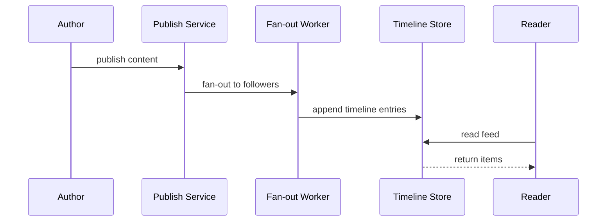

# Feed / Timeline — Core Flow

**Supports decision:** show the write and read paths for feed delivery.

```mermaid
sequenceDiagram
  participant A as Author
  participant P as Publish Service
  participant F as Fan-out Worker
  participant T as Timeline Store
  participant R as Reader

  A->>P: publish content
  P->>F: fan-out to followers
  F->>T: append timeline entries
  R->>T: read feed
  T-->>R: return items
```