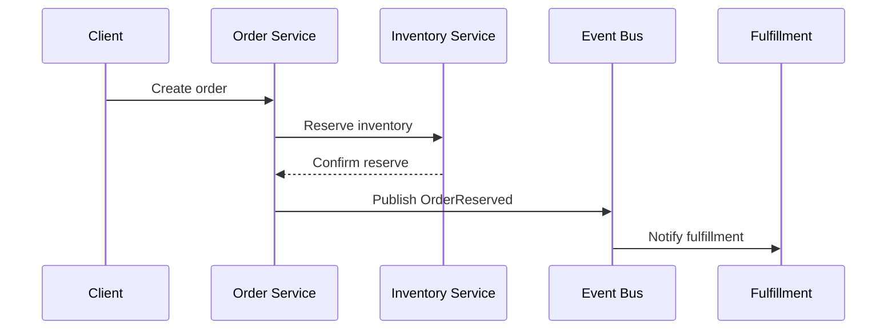

# E-Commerce Inventory and Orders

An e-commerce order system must coordinate inventory reservations, order state, and fulfillment while preventing oversell. The design should use strong consistency on the hot inventory path and decouple order processing from fulfillment through events.

## Problem framing

- **Users:** buyers, fulfillment teams, inventory managers
- **Peak load:** thousands of orders per second during flash sales
- **Critical path:** reserve inventory in <100ms and confirm order validity
- **Business goals:** avoid oversell, support partial fulfillment, support returns and cancellations

## Requirements

- Reserve inventory when orders are placed
- Prevent overselling across distributed inventory services
- Track order lifecycle through payment, fulfillment, and shipping
- Support cancellations, returns, and stock adjustments
- Provide event history for analytics and reconciliation

## Key constraints

- Inventory is a shared scarce resource with global availability constraints
- Order and inventory services may be decoupled across teams and regions
- Strong consistency is usually required for reservation decisions
- Cancellation and return workflows must update inventory correctly
- Flash sale traffic can create extremely high contention on popular SKUs

## Architecture overview

- **Order service** validates order requests and emits reservation events.
- **Inventory service** reserves stock and confirms availability.
- **Saga coordinator** drives payment, reservation, and fulfillment steps.
- **Event bus** connects order, inventory, and fulfillment services.
- **Read model** supports order status views and inventory snapshots.

## API sketch

| Method | Path | Notes |
|--------|------|-------|
| POST | /orders | Create order and reserve inventory |
| GET | /orders/{id} | Query order status |
| POST | /orders/{id}/cancel | Cancel order and release stock |
| POST | /inventory/{sku}/adjust | Adjust stock levels |

## Data model

- `Order`
  - `orderId`
  - `userId`
  - `items`
  - `status`
  - `totalAmount`
  - `reservedAt`

- `InventoryReservation`
  - `reservationId`
  - `sku`
  - `quantity`
  - `orderId`
  - `status`
  - `expiresAt`

- `InventoryStock`
  - `sku`
  - `available`
  - `allocated`
  - `threshold`

## Diagrams

- [Context](./diagrams/context.md)
- [Components](./diagrams/components.md)
- [Core flow](./diagrams/core-flow.md)

## Code examples

- [Java](./java/InventoryReservationService.java)
- [Go](./go/reservation_service.go)

## Code sketch: reservation and outbox

```java
public void reserve(Order order) {
  if (!inventoryService.reserve(order.getItems())) {
    throw new OutOfStockException();
  }
  outbox.publish(new OrderReserved(order.getId()));
}
```

```go
func reserveInventory(order Order) error {
  ok := inventoryService.Reserve(order.Items)
  if !ok {
    return ErrOutOfStock
  }
  outbox.Publish(OrderReserved{OrderID: order.ID})
  return nil
}
```

## Reliability and failure modes

- **Oversell due to async reconciliation:** enforce reservation before confirmation and use strong locks if needed
- **Reservation expiration:** expire stale reservations and return stock to inventory
- **Order cancel/return race:** serialize stock adjustments with reservation events
- **Inventory oversell in flash sale:** shard SKUs and use local contention-aware reserving
- **Event bus delay:** keep order status pending until inventory confirmation and retry events from outbox

## Diagram



## If I had two more weeks

- Add inventory forecasting and demand-aware reordering
- Add stock hold policies for pre-orders and backorders
- Add more advanced order routing and multi-warehouse fulfillment

## Three scale triggers

1. **Flash sale hot SKUs** → add token buckets and local reservation partitions
2. **Return/cancel volume** → add compensation workflows and idempotent stock updates
3. **Global inventory synchronization** → add near-real-time inventory replication and conflict resolution

## Interview prompts

- How do you prevent oversell in a distributed order system?
- Why use an outbox pattern in inventory/order coordination?
- What are the trade-offs between strong reservation locking and eventually consistent inventory?
