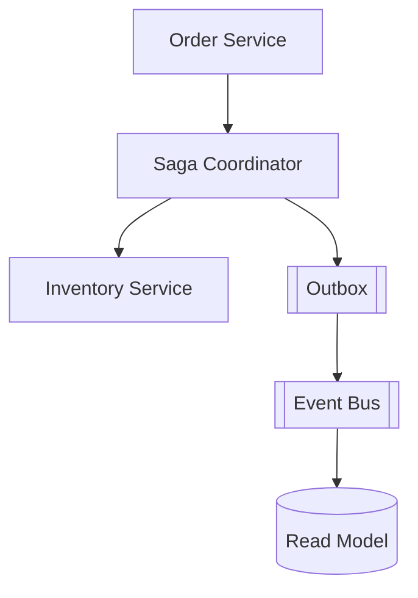

# E-Commerce Inventory and Orders — Components

**Supports decision:** show the services and state stores in the order/inventory saga.

```mermaid
flowchart TB
  order[Order Service]
  inventory[Inventory Service]
  saga[Saga Coordinator]
  bus[[Event Bus]]
  read[(Read Model)]
  outbox[[Outbox]]

  order --> saga --> inventory
  saga --> outbox --> bus
  bus --> read
```