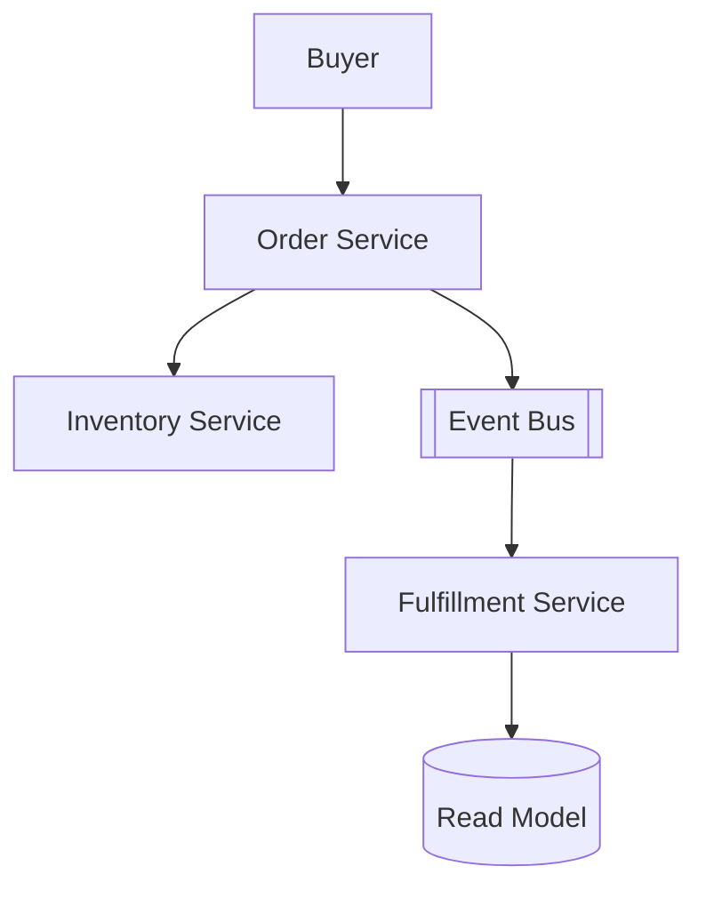

# E-Commerce Inventory and Orders — Context

**Supports decision:** show interactions between order service, inventory service, and event bus.

```mermaid
flowchart TB
  client[Buyer]
  order[Order Service]
  inventory[Inventory Service]
  bus[[Event Bus]]
  fulfillment[Fulfillment Service]
  store[(Read Model)]

  client --> order
  order --> inventory
  order --> bus --> fulfillment
  fulfillment --> store
```