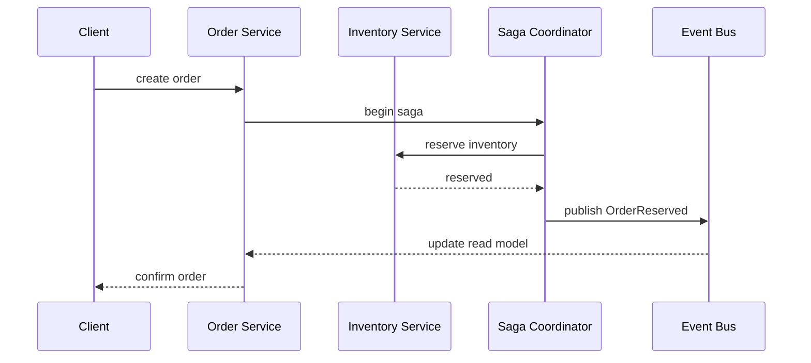

# E-Commerce Inventory and Orders — Core Flow

**Supports decision:** describe the reservation and order confirmation flow.

```mermaid
sequenceDiagram
  participant C as Client
  participant O as Order Service
  participant I as Inventory Service
  participant S as Saga Coordinator
  participant B as Event Bus

  C->>O: create order
  O->>S: begin saga
  S->>I: reserve inventory
  I-->>S: reserved
  S->>B: publish OrderReserved
  B-->>O: update read model
  O-->>C: confirm order
```