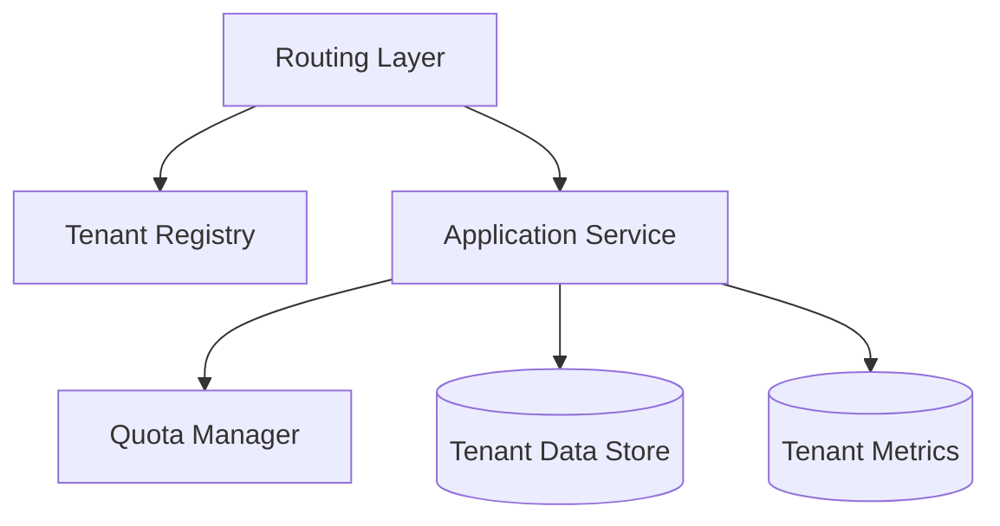

# Multi-Tenant SaaS — Components

**Supports decision:** identify tenant registry, quota manager, and isolation enforcement.

```mermaid
flowchart TB
  router[Routing Layer]
  tenantRegistry[Tenant Registry]
  quota[Quota Manager]
  service[Application Service]
  storage[(Tenant Data Store)]
  observability[(Tenant Metrics)]

  router --> service
  router --> tenantRegistry
  service --> quota
  service --> storage
  service --> observability
```