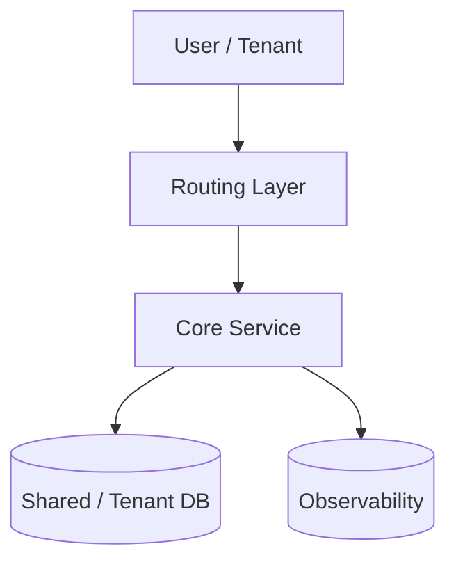

# Multi-Tenant SaaS — Context

**Supports decision:** show tenant requests, platform routing, and shared service boundaries.

```mermaid
flowchart TB
  tenant[User / Tenant]
  routing[Routing Layer]
  service[Core Service]
  db[(Shared / Tenant DB)]
  metrics[(Observability)]

  tenant --> routing --> service
  service --> db
  service --> metrics
```