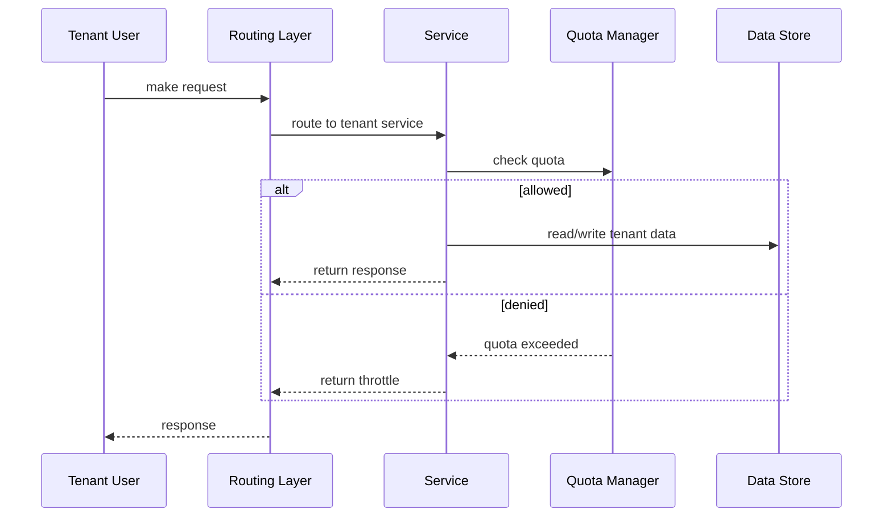

# Multi-Tenant SaaS — Core Flow

**Supports decision:** describe tenant request routing and quota enforcement.

```mermaid
sequenceDiagram
  participant U as Tenant User
  participant R as Routing Layer
  participant S as Service
  participant Q as Quota Manager
  participant D as Data Store

  U->>R: make request
  R->>S: route to tenant service
  S->>Q: check quota
  alt allowed
    S->>D: read/write tenant data
    S-->>R: return response
  else denied
    Q-->>S: quota exceeded
    S-->>R: return throttle
  end
  R-->>U: response
```