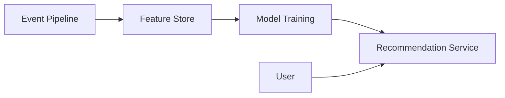

# AI Recommendation System

A recommendation system must generate personalized results using offline feature computation and online serving. The design should balance model freshness, latency, and the cold-start problem for new users and items.

## Problem framing

- **Users:** product consumers, personalization engines, internal analytics
- **Peak load:** tens of thousands of recommendation requests per second
- **Critical path:** produce recommendations in <100ms for low-latency UX
- **Business goals:** relevance, conversion, and model explainability

## Requirements

- Ingest user actions and item metadata into feature pipelines
- Serve personalized recommendations with low latency
- Handle new users/items and sparse interaction data
- Track model performance and support A/B evaluation
- Provide offline training and online feature refresh

## Key constraints

- Models need both offline batch features and online real-time signals
- Cold-start users/items lack historical data
- Feature stores must serve both training and inference consistently
- Overpersonalization can reduce diversity and increase filter bubbles
- Serving infrastructure must be resilient to model and data drift

## Architecture overview

- **Event pipeline** ingests user interactions and item updates.
- **Feature engineering** builds offline features and materializes them in a feature store.
- **Model training** generates ranking and candidate selection models.
- **Online serving** scores candidates using real-time features and returns ranked recommendations.
- **Evaluation service** tracks metrics and supports experiment analysis.

## API sketch

| Method | Path | Notes |
|--------|------|-------|
| GET | /recommendations | Serve personalized candidates |
| POST | /feedback | Capture user action signals |
| GET | /models/{id}/metrics | Model performance |

## Data model

- `UserEvent`
  - `userId`
  - `eventType`
  - `itemId`
  - `timestamp`

- `FeatureVector`
  - `entityId`
  - `features`
  - `lastUpdated`

- `RecommendationResult`
  - `userId`
  - `itemId`
  - `score`
  - `rank`

## Diagrams

- [Context diagram](./diagrams/context.md)
- [Components diagram](./diagrams/components.md)
- [Core flow diagram](./diagrams/core-flow.md)

## Code examples

- Online scoring fallback using real-time and batch features

## Code sketch: online scoring fallback

```java
if (onlineFeatureStore.hasRealTimeFeatures(userId)) {
  score = model.score(onlineFeatures);
} else {
  score = model.score(basicProfileFeatures);
}
return rankCandidates(candidates, score);
```

## Reliability and failure modes

- **Stale models:** track model version and serve fallback model if the latest fails
- **Feature mismatch:** validate feature schemas between training and serving
- **Cold start:** use popularity and content-based features for new users/items
- **Data drift:** monitor feature distributions and model performance continuously
- **Serving outage:** degrade to cached recommendations or simpler heuristics

## Diagram



## If I had two more weeks

- Add multi-arm bandit exploration for personalization
- Add counterfactual evaluation for offline policy testing
- Add a feature lineage system for faster root cause analysis

## Three scale triggers

1. **Serving latency pressure** → cache recommendations and precompute candidate lists
2. **Feedback volume rises** → separate online and offline feature churn paths
3. **Model quality drops** → add stronger drift detection and automated rollback

## Interview prompts

- What is the cold-start problem and how do you handle it in recommendations?
- Why separate offline feature pipelines from online serving?
- How do you keep training and serving features consistent?
