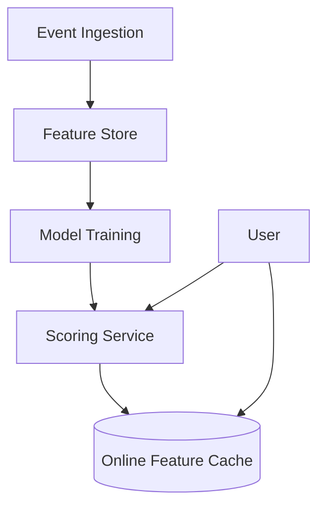

# AI Recommendation System — Components

**Supports decision:** identify event ingestion, feature storage, model training, and serving.

```mermaid
flowchart TB
  events[Event Ingestion]
  features[Feature Store]
  training[Model Training]
  scoring[Scoring Service]
  cache[(Online Feature Cache)]
  user[User]

  events --> features
  features --> training
  training --> scoring
  scoring --> cache
  user --> scoring
  user --> cache
```