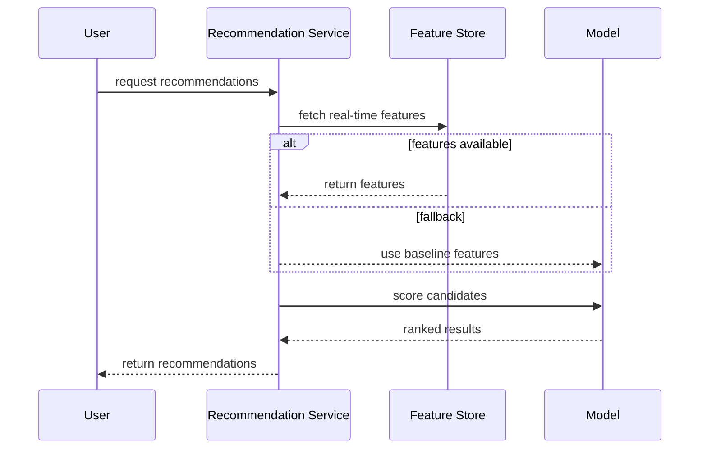

# AI Recommendation System — Core Flow

**Supports decision:** show the online scoring path with feature lookup.

```mermaid
sequenceDiagram
  participant U as User
  participant R as Recommendation Service
  participant F as Feature Store
  participant M as Model

  U->>R: request recommendations
  R->>F: fetch real-time features
  alt features available
    F-->>R: return features
  else fallback
    R-->>M: use baseline features
  end
  R->>M: score candidates
  M-->>R: ranked results
  R-->>U: return recommendations
```