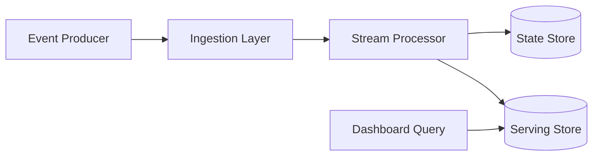

# Real-Time Analytics / Metrics Pipeline

A real-time analytics pipeline must ingest streaming events, compute aggregates, and serve fast query results. The design should maintain correctness through retries, support time-windowed aggregation, and separate ingestion from serving.

## Problem framing

- **Users:** product analytics, monitoring dashboards, decision support
- **Peak load:** millions of events per second, thousands of query requests
- **Critical path:** update metrics within seconds and answer queries in <200ms
- **Business goals:** accurate aggregates, low-latency insights, and fault-tolerant ingestion

## Requirements

- Ingest event streams from services and user actions
- Compute rolling windows and time-series aggregates
- Serve metrics to dashboards and query APIs
- Handle late-arriving data and reorder events by event time
- Ensure exactly-once or idempotent processing semantics

## Key constraints

- Event-time processing requires watermarking and lateness handling
- Exactly-once semantics are hard over network retries and app failures
- Windowed aggregation amplifies state size and checkpointing requirements
- Serving must separate hot query workloads from ingestion cost
- Backpressure in ingestion should not drop critical data silently

## Architecture overview

- **Ingestion layer** receives and persists raw event streams.
- **Stream processor** computes aggregates and emits windowed results.
- **State store** holds intermediate window state and supports recovery.
- **Serving layer** stores materialized aggregates for read queries.
- **Query API** provides dashboards and ad hoc analytics.

## API sketch

| Method | Path | Notes |
|--------|------|-------|
| POST | /events | Ingest event batch |
| GET | /metrics | Query time-series aggregates |
| GET | /health | Pipeline health status |

## Data model

- `Event`
  - `eventId`
  - `source`
  - `type`
  - `timestamp`
  - `payload`

- `WindowState`
  - `windowStart`
  - `windowEnd`
  - `aggregate`
  - `watermark`

- `MetricsRow`
  - `metricName`
  - `timestamp`
  - `value`
  - `dimensions`

## Diagrams

- [Context diagram](./diagrams/context.md)
- [Components diagram](./diagrams/components.md)
- [Core flow diagram](./diagrams/core-flow.md)

## Code examples

- Event dedupe logic for idempotent ingestion

## Code sketch: event dedupe key

```go
func processEvent(evt Event) error {
  dedupeKey := fmt.Sprintf("%s:%s", evt.Source, evt.EventId)
  if dedupeStore.Exists(dedupeKey) {
    return nil
  }
  dedupeStore.Save(dedupeKey)
  aggregate(evt)
  return nil
}
```

## Reliability and failure modes

- **Late events:** use watermarks and allowed lateness windows in window aggregation
- **Duplicate events:** use idempotency / dedupe keys or exactly-once storage
- **State loss:** checkpoint state regularly and restore from durable storage
- **Hot partitions:** shard by event dimensions or use dynamic partitioning
- **Query staleness:** separate real-time hot paths from slower batch recomputation

## Diagram



## If I had two more weeks

- Add a unified query layer for both real-time and historical metrics
- Add automated anomaly detection and alert generation
- Add multi-tenancy and dimension cardinality control

## Three scale triggers

1. **Event volume spikes** → partition events more aggressively and autoscale ingestion
2. **State size growth** → trim windows, use compaction, and tier older aggregates
3. **Query load rises** → add read shards and precompute common dashboards

## Interview prompts

- How do you implement exactly-once semantics in a streaming pipeline?
- What is watermarking and why is it important for late-arriving events?
- How do you separate ingestion and serving workloads in a metrics pipeline?
