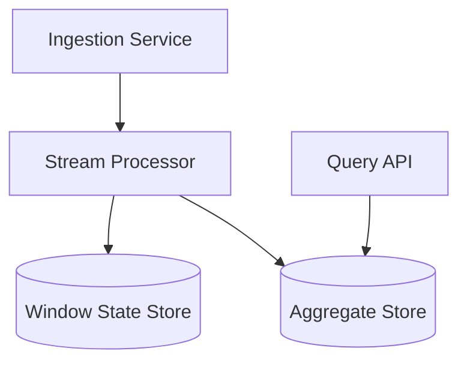

# Real-Time Analytics / Metrics Pipeline — Components

**Supports decision:** identify ingestion, stream processing, state, and serving.

```mermaid
flowchart TB
  ingest[Ingestion Service]
  stream[Stream Processor]
  state[(Window State Store)]
  serving[(Aggregate Store)]
  query[Query API]

  ingest --> stream
  stream --> state
  stream --> serving
  query --> serving
```