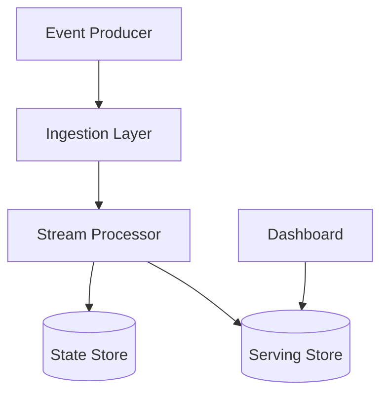

# Real-Time Analytics / Metrics Pipeline — Context

**Supports decision:** show the pipeline from event producers through serving to dashboards.

```mermaid
flowchart TB
  producer[Event Producer]
  ingest[Ingestion Layer]
  processor[Stream Processor]
  state[(State Store)]
  serving[(Serving Store)]
  dashboard[Dashboard]

  producer --> ingest --> processor
  processor --> state
  processor --> serving
  dashboard --> serving
```