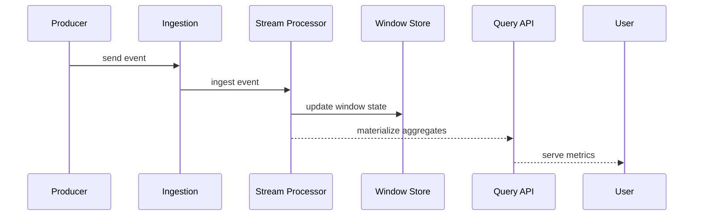

# Real-Time Analytics / Metrics Pipeline — Core Flow

**Supports decision:** show event ingestion, deduplication, and window aggregation.

```mermaid
sequenceDiagram
  participant P as Producer
  participant I as Ingestion
  participant S as Stream Processor
  participant W as Window Store
  participant Q as Query API

  P->>I: send event
  I->>S: ingest event
  S->>W: update window state
  S-->>Q: materialize aggregates
  Q-->>User: serve metrics
```