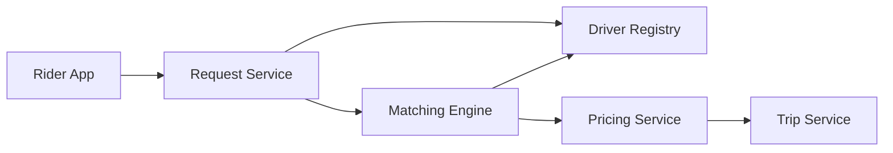

# Ride-Hailing / Geospatial Matching

A ride-hailing system must match riders to drivers in real time using geospatial indexes, manage surge pricing, and maintain availability across a geographic region. The design should prioritize low pickup latency, efficient dispatch, and resilience under demand shocks.

## Problem framing

- **Users:** riders, drivers, dispatch services
- **Peak load:** thousands of matching requests per second in major cities
- **Critical path:** find and assign a driver in <500ms
- **Business goals:** minimize wait time, balance supply, and support surge pricing

## Requirements

- Accept rider requests with pickup/dropoff points
- Match riders to nearby available drivers
- Support surge pricing and dynamic dispatch rules
- Maintain driver availability and trip state
- Handle cancellations, repositioning, and regional failures

## Key constraints

- Geospatial queries must be fast and approximate over large active sets
- Driver availability is highly dynamic and inconsistent across regions
- Surge pricing introduces feedback loops that affect demand and supply
- Dispatch decisions must remain highly available under partial failure
- Cross-region rider/driver movement adds replication complexity

## Architecture overview

- **Request service** accepts ride requests and validates location data.
- **Driver registry** tracks current driver positions and availability.
- **Matching engine** queries nearby drivers using geospatial indexes.
- **Pricing service** computes surge multiplier and estimated cost.
- **Trip service** coordinates assignment, pickup, and trip lifecycle.

## API sketch

| Method | Path | Notes |
|--------|------|-------|
| POST | /ride/request | Create ride request |
| GET | /ride/status/{id} | Get current trip status |
| POST | /driver/{id}/update | Update driver location |
| POST | /ride/cancel | Cancel ride |

## Data model

- `RideRequest`
  - `requestId`
  - `userId`
  - `pickupLocation`
  - `dropoffLocation`
  - `requestedAt`
  - `status`

- `DriverState`
  - `driverId`
  - `location`
  - `available`
  - `rating`
  - `lastUpdate`

- `SurgeZone`
  - `zoneId`
  - `supplyDemandRatio`
  - `multiplier`
  - `updatedAt`

## Diagrams

- [Context diagram](./diagrams/context.md)
- [Components diagram](./diagrams/components.md)
- [Core flow diagram](./diagrams/core-flow.md)

## Reliability and failure modes

- **Location staleness:** use short TTLs and frequent driver updates
- **Too few matches:** widen search radius and use secondary pools
- **Surge feedback loops:** smooth pricing changes and cap multiplier growth
- **Partial region failure:** reroute riders to nearby healthy regions or degrade gracefully
- **High write load:** shard driver state by geography and use local caches

## Diagram

## If I had two more weeks

- Add predictive repositioning for idle drivers
- Add multi-modal dispatch and pooled ride support
- Add better failure handling for cross-region retry and customer communication

## Three scale triggers

1. **Large city demand spikes** → partition matching by geography and add standby capacity
2. **Driver surge volatility** → add driver incentives and demand smoothing controls
3. **Region outage** → support fallback routing and multi-region resilience

## Interview prompts

- How do you design geospatial matching for low-latency dispatch?
- What are the trade-offs of using approximate vs exact nearest-neighbor search?
- How would you manage surge pricing to avoid oscillation?
