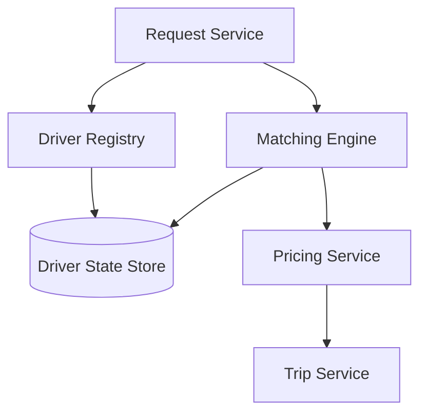

# Ride-Hailing / Geospatial Matching — Components

**Supports decision:** identify request service, driver state store, and matching flow.

```mermaid
flowchart TB
  request[Request Service]
  registry[Driver Registry]
  match[Matching Engine]
  pricing[Pricing Service]
  trip[Trip Service]
  store[(Driver State Store)]

  request --> registry --> store
  request --> match
  match --> store
  match --> pricing
  pricing --> trip
```