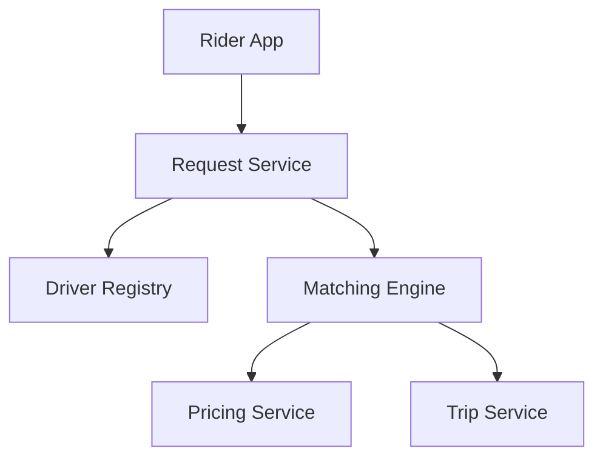

# Ride-Hailing / Geospatial Matching — Context

**Supports decision:** show rider requests, driver registry, and matching engine boundaries.

```mermaid
flowchart TB
  rider[Rider App]
  request[Request Service]
  registry[Driver Registry]
  match[Matching Engine]
  pricing[Pricing Service]
  trip[Trip Service]

  rider --> request
  request --> registry
  request --> match
  match --> pricing
  match --> trip
```