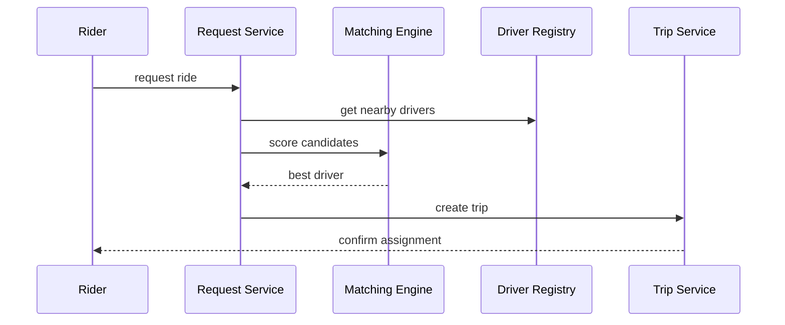

# Ride-Hailing / Geospatial Matching — Core Flow

**Supports decision:** document the ride matching and assignment path.

```mermaid
sequenceDiagram
  participant R as Rider
  participant Q as Request Service
  participant M as Matching Engine
  participant D as Driver Registry
  participant T as Trip Service

  R->>Q: request ride
  Q->>D: get nearby drivers
  Q->>M: score candidates
  M-->>Q: best driver
  Q->>T: create trip
  T-->>R: confirm assignment
```