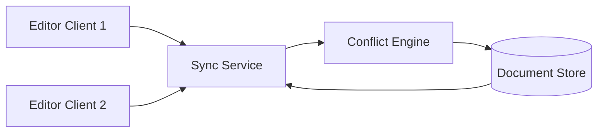

# Collaborative Document Editor

A collaborative document editor must allow multiple users to edit concurrently, preserve intention, and resolve conflicts in real time. The design should support offline working, merge resilience, and efficient state synchronization.

## Problem framing

- **Users:** editors, collaborators, co-authors
- **Peak load:** many concurrent edits on active documents
- **Critical path:** sync user edits in <200ms and avoid data loss
- **Business goals:** preserve collaboration state, minimize conflicts, support offline sync

## Requirements

- Support concurrent edits from multiple users
- Preserve document state and resolve conflicting operations
- Sync updates in real time and support offline changes
- Track presence and editing cursors
- Provide consistent document state after reconnects

## Key constraints

- Real-time sync must be low-latency and resilient to network jitter
- Conflict resolution algorithm must converge for all participants
- Offline edits require merge logic and replay on reconnect
- Document state size can grow large, requiring compaction
- Presence and cursor data are transient but critical for collaboration

## Architecture overview

- **Editor client** sends operations and applies remote updates.
- **Sync service** routes edit operations and maintains document versions.
- **Conflict engine** applies CRDT or OT merge rules.
- **Persistence layer** stores the canonical document state and history.
- **Presence service** tracks active users and cursors.

## API sketch

| Method | Path | Notes |
|--------|------|-------|
| WS | /sync | Real-time editor sync |
| GET | /doc/{id} | Fetch current document snapshot |
| POST | /doc/{id}/save | Persist snapshot |
| GET | /presence/{docId} | Get active collaborators |

## Data model

- `DocOperation`
  - `opId`
  - `docId`
  - `userId`
  - `type`
  - `position`
  - `content`
  - `timestamp`

- `DocumentState`
  - `docId`
  - `content`
  - `version`
  - `lastModified`

- `Presence`
  - `userId`
  - `docId`
  - `cursorPosition`
  - `status`

## Diagrams

- [Context diagram](./diagrams/context.md)
- [Components diagram](./diagrams/components.md)
- [Core flow diagram](./diagrams/core-flow.md)

## Reliability and failure modes

- **Conflicting edits:** use convergent CRDTs or OT with transformation rules
- **Network partition:** buffer operations locally and reconcile on reconnect
- **State divergence:** use periodic snapshot and hash verification between clients
- **Document growth:** compact operation logs and checkpoint state
- **Slow clients:** throttle or transform operations to avoid blocking real-time sync

## Diagram

## If I had two more weeks

- Add version history and undo/redo support across collaborators
- Add offline-first support with CRDT conflict resolution on sync
- Add access control and real-time commenting tools

## Three scale triggers

1. **Many concurrent collaborators** → optimize per-document sharding and local buffering
2. **Long-lived documents** → compact and checkpoint operation history regularly
3. **Editor plugin growth** → add extensible metadata and custom collaborator features

## Interview prompts

- What are the core differences between OT and CRDT for collaborative editing?
- How do you keep document state consistent across offline edits?
- When would you choose operation log compaction versus snapshotting?
