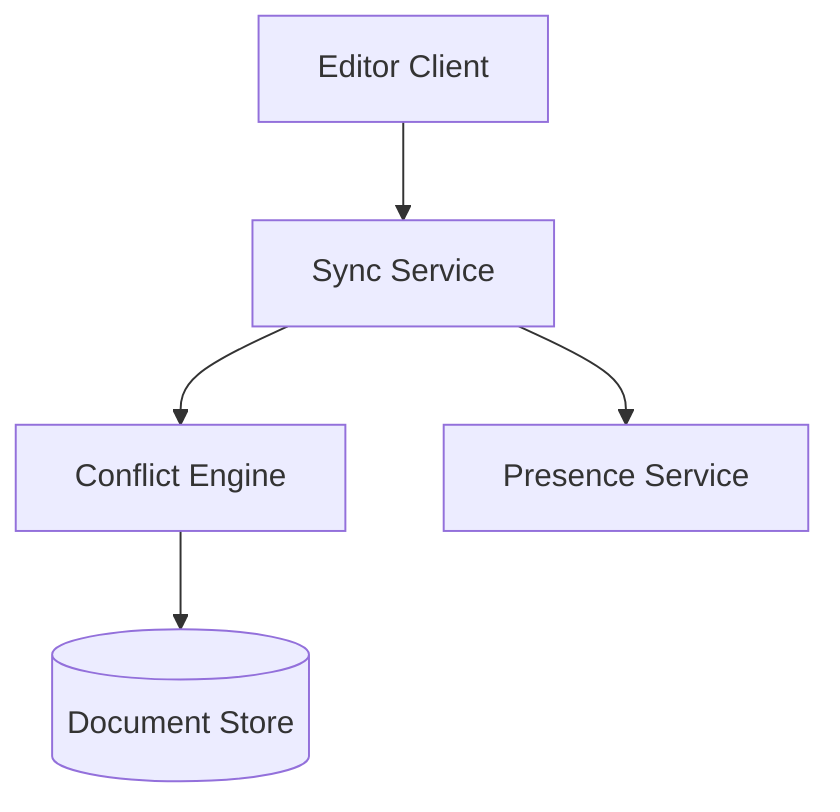

# Collaborative Document Editor — Components

**Supports decision:** identify sync, merge, presence, and persistence components.

```mermaid
flowchart TB
  sync[Sync Service]
  engine[Conflict Engine]
  store[(Document Store)]
  presence[Presence Service]
  client[Editor Client]

  client --> sync
  sync --> engine --> store
  sync --> presence
```