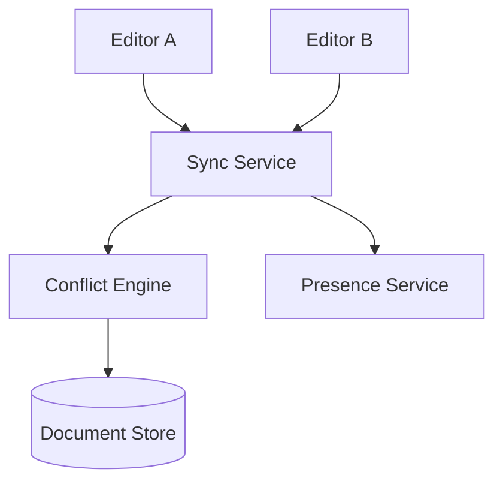

# Collaborative Document Editor — Context

**Supports decision:** show editors, sync service, and persistence boundaries.

```mermaid
flowchart TB
  clientA[Editor A]
  clientB[Editor B]
  sync[Sync Service]
  engine[Conflict Engine]
  store[(Document Store)]
  presence[Presence Service]

  clientA --> sync
  clientB --> sync
  sync --> engine --> store
  sync --> presence
```