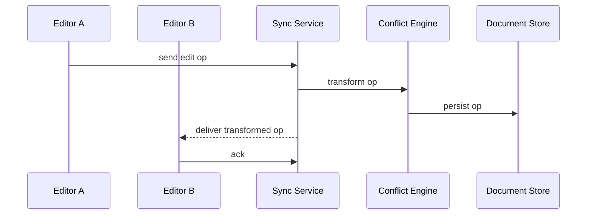

# Collaborative Document Editor — Core Flow

**Supports decision:** show the sync path for concurrent edits across editors.

```mermaid
sequenceDiagram
  participant A as Editor A
  participant B as Editor B
  participant S as Sync Service
  participant E as Conflict Engine
  participant D as Document Store

  A->>S: send edit op
  S->>E: transform op
  E->>D: persist op
  S-->>B: deliver transformed op
  B->>S: ack
```