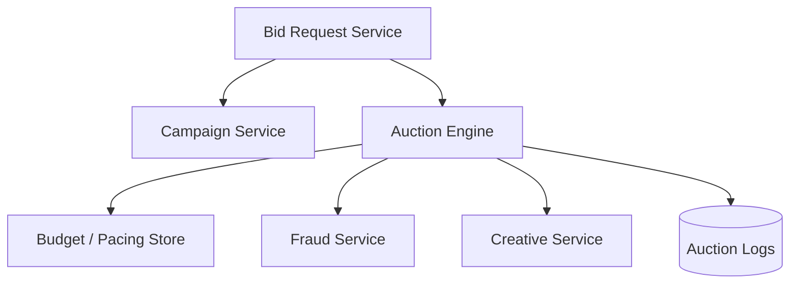

# Ad Bidding / Real-Time Auction — Components

**Supports decision:** identify the real-time auction, budget, and fraud components.

```mermaid
flowchart TB
  request[Bid Request Service]
  campaign[Campaign Service]
  auction[Auction Engine]
  budget[Budget / Pacing Store]
  fraud[Fraud Service]
  creative[Creative Service]
  logger[(Auction Logs)]

  request --> campaign
  request --> auction
  auction --> budget
  auction --> fraud
  auction --> creative
  auction --> logger
```