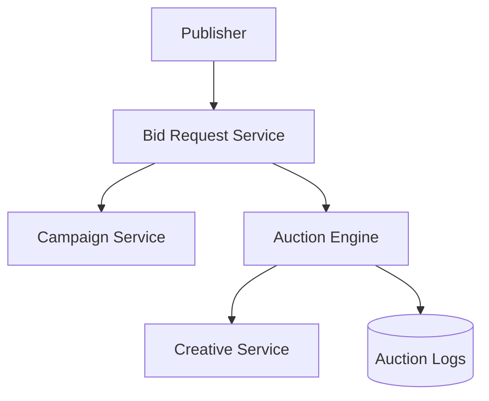

# Ad Bidding / Real-Time Auction — Context

**Supports decision:** show bidders, auction engine, campaign service, and publisher interaction.

```mermaid
flowchart TB
  publisher[Publisher]
  bidReq[Bid Request Service]
  campaign[Campaign Service]
  auction[Auction Engine]
  creative[Creative Service]
  logger[(Auction Logs)]

  publisher --> bidReq
  bidReq --> campaign
  bidReq --> auction
  auction --> creative
  auction --> logger
```