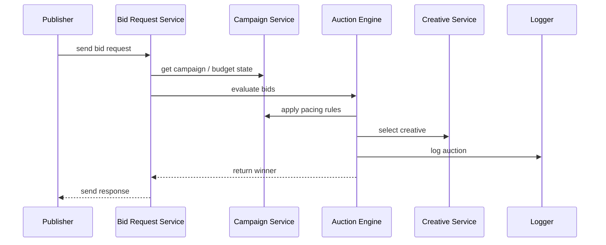

# Ad Bidding / Real-Time Auction — Core Flow

**Supports decision:** show the real-time auction decision path and winner response.

```mermaid
sequenceDiagram
  participant P as Publisher
  participant R as Bid Request Service
  participant C as Campaign Service
  participant A as Auction Engine
  participant CR as Creative Service
  participant L as Logger

  P->>R: send bid request
  R->>C: get campaign / budget state
  R->>A: evaluate bids
  A->>C: apply pacing rules
  A->>CR: select creative
  A->>L: log auction
  A-->>R: return winner
  R-->>P: send response
```