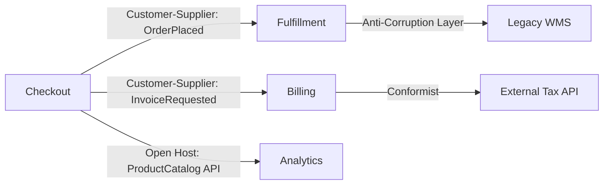

# Context Map — Integration Relationships

**Supports decision:** Whether fulfillment should **conform** to checkout events, **translate** via ACL, or **negotiate** a partnership API.

| Arrow | Pattern | You document |
|-------|---------|--------------|
| Checkout → Fulfillment | Customer–supplier | Event schema version, idempotency key, DLQ owner |
| Fulfillment → Legacy WMS | ACL | Mapping table, retry policy, vendor outage fallback |
| Checkout → Analytics | Conformist (often) | Analytics accepts checkout event shape; no write-back |

**Conway’s law:** If the map says customer–supplier but **one manager owns both teams**, expect the “supplier” to be ignored—realign teams or integration governance ([Chapter 31: Architecture Governance](../../31-architecture-governance/README.md)).
