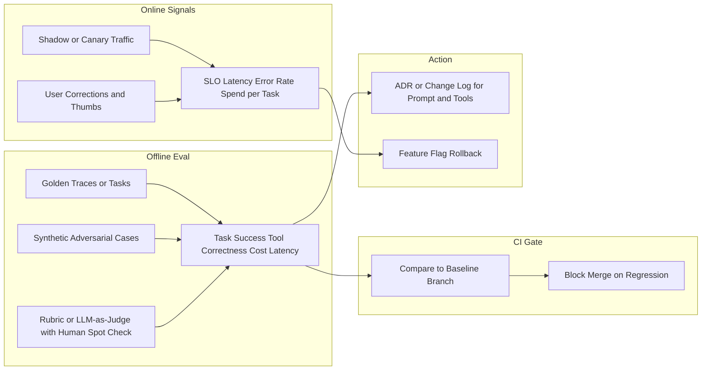

# Evaluation for Agent Workflows — Offline to Online Loop

**Supports decision:** What to measure before shipping prompt or tool changes, and how to catch regressions on multi-step flows—not only single-turn accuracy.

**Caption:** **Golden workflows** anchor regression tests; **online** SLOs catch drift, abuse, and model provider changes. Tie releases to **flags** so prompt v2 can roll back without redeploying the whole service ([Chapter 34](../../34-agentic-systems-and-mlops-for-ai/README.md) MLOps context).
